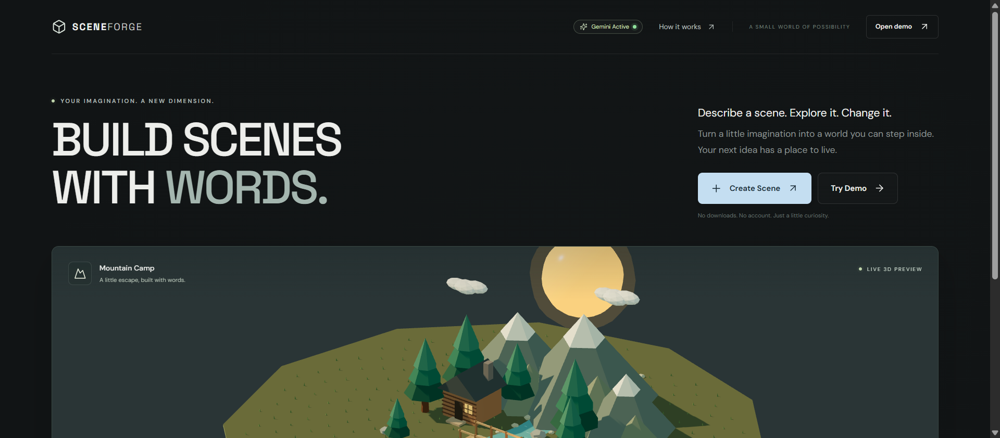
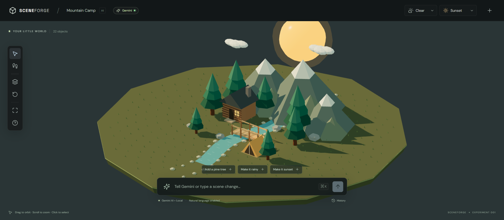
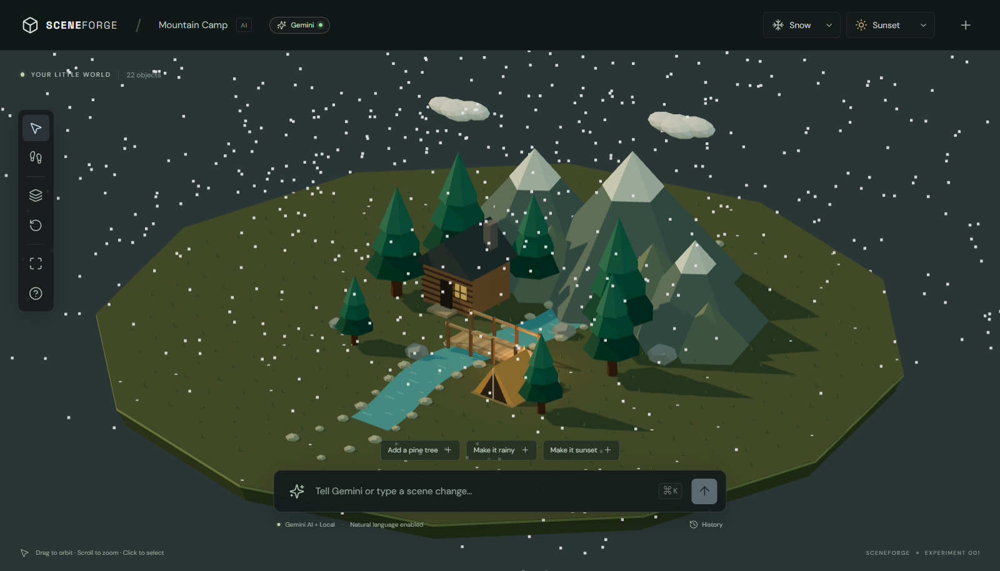

<div align="center">

  <h1>✨ SCENEFORGE</h1>
  <p><strong>Build 3D scenes with words — powered by Google Gemini AI & React Three Fiber.</strong></p>

  <p>
    <a href="https://sceneforge.deploylane.online"><strong>🌐 Explore Live App »</strong></a>
  </p>

  <p>
    
    
    
    
  </p>

  <br />
  
  <br />
</div>

---

## 🌟 Overview

**SceneForge** is an AI-powered interactive 3D scene builder. Describe any place in natural language—like *"A quiet mountain camp beside a river at sunset"* or *"A small medieval village with pine trees"*—and watch it render instantly as an interactive 3D world in your browser.

- **Deployed on Deploylane** — Live at [sceneforge.deploylane.online](https://sceneforge.deploylane.online)
- **Natural Language Editing** — Add, move, or remove objects and shift lighting using plain English prompt commands.
- **Zero Config Required** — Features a built-in deterministic local generator alongside Google Gemini AI integration.

---

## 📸 Visual Showcase

### 🎨 The Interactive 3D Editor
Explore scenes with full orbit, zoom, and pan controls, or inspect individual 3D elements in real-time.



<br />

### ❄️ Weather & Environment Effects
Toggle between dynamic weather states (Clear, Rain, Snow, Fog, Cloudy) and times of day (Morning, Afternoon, Sunset, Night) with low-poly particle physics.



---

## ✨ Key Features

- 🤖 **Gemini AI Generator & Editor** — Uses Google Gemini 2.5 Flash to translate user intent into structured 3D scenes.
- 🌲 **Low-Poly Procedural World** — High-performance 3D models with instanced grass, rivers, mountains, and customizable terrain.
- 🏃 **First-Person Walk Mode** — Step inside your created world with full WASD controls, sprinting, jumping, and mouse look.
- ☀️ **Dynamic Sun & Lighting** — Real-time shadow maps, custom sun placement per time-of-day, and sky gradients.
- 🛠️ **Dual Engine Architecture** — Seamlessly switches between local rule-based generation (offline) and Gemini AI.

---

## 🛠️ Tech Stack

- **Frontend & Rendering:** React 18, React Three Fiber (R3F), Three.js, `@react-three/drei`
- **State Management:** Zustand
- **AI Integration:** Google Gemini API (`gemini-2.5-flash`)
- **Build Tool & Bundler:** Vite
- **Deployment Platform:** Deployed on **Deploylane**

---

## 🚀 Getting Started

### Local Development

1. **Clone the repository:**
   ```bash
   git clone https://github.com/Jatinnn-ui/SceneForge.git
   cd SceneForge
   ```

2. **Install dependencies:**
   ```bash
   npm install
   ```

3. **Start the development server:**
   ```bash
   npm run dev
   ```

4. **Open in browser:**
   Navigate to `http://localhost:3000`

---

## 🔑 AI Configuration (Optional)

SceneForge works out-of-the-box with its offline local generator. To enable Google Gemini AI generation:
1. Get a free Gemini API key from [Google AI Studio](https://aistudio.google.com/app/apikey).
2. Click the **Connect AI** button in the SceneForge header.
3. Paste your API key (stored securely in your browser's `localStorage` only).

---

## 📜 License

Distributed under the MIT License. Built with ❤️ by [Jatinnn-ui](https://github.com/Jatinnn-ui).
